# ControlNet + OpenPose Character Consistency Pipeline

A production-oriented ComfyUI workflow designed to maintain character pose consistency using OpenPose and ControlNet with SDXL.

This project demonstrates how structural conditioning can be introduced into diffusion models to achieve predictable and repeatable outputs.

---

## Problem Statement

Traditional text-to-image workflows produce different poses and body structures for each generation.

This makes it difficult to:

* Maintain character consistency
* Create storyboards
* Build previs sequences
* Generate production-ready assets

---

## Solution

This workflow uses:

* SDXL
* OpenPose
* ControlNet
* LoRA
* KSampler
* Upscaling

to preserve pose information while allowing prompt-driven image generation.

---

## Architecture Diagram

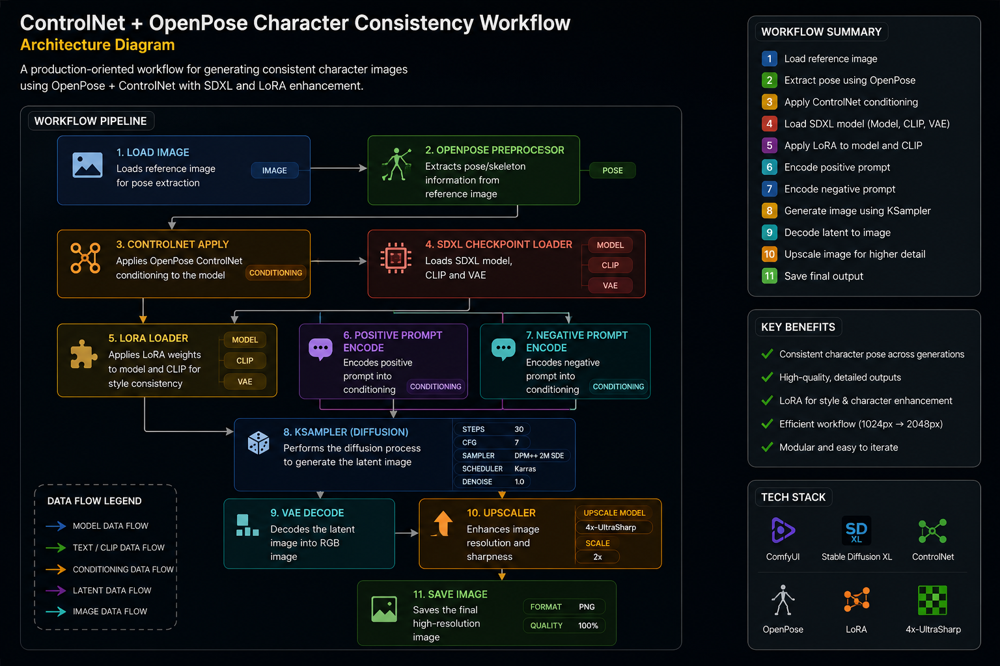

---

## Workflow Graph

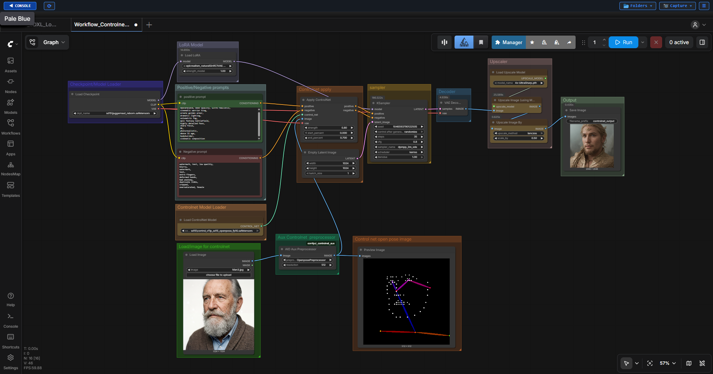
---
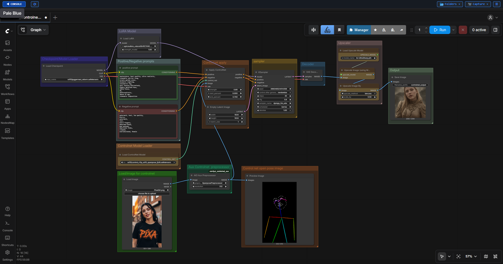
---
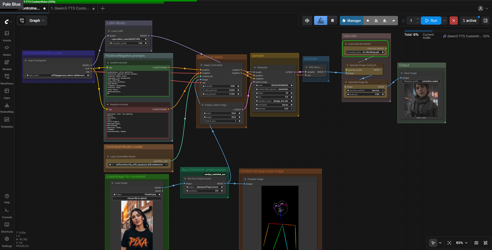

---

## Sample Outputs

### Pose Reference

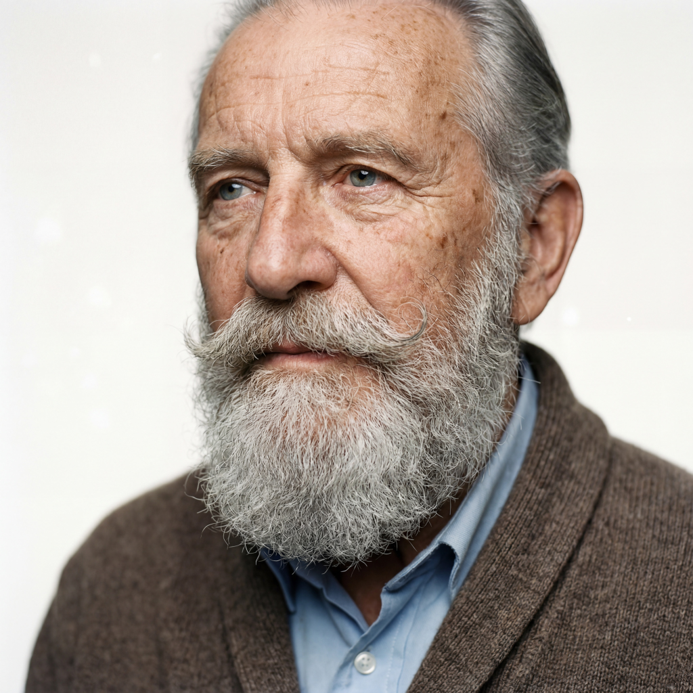
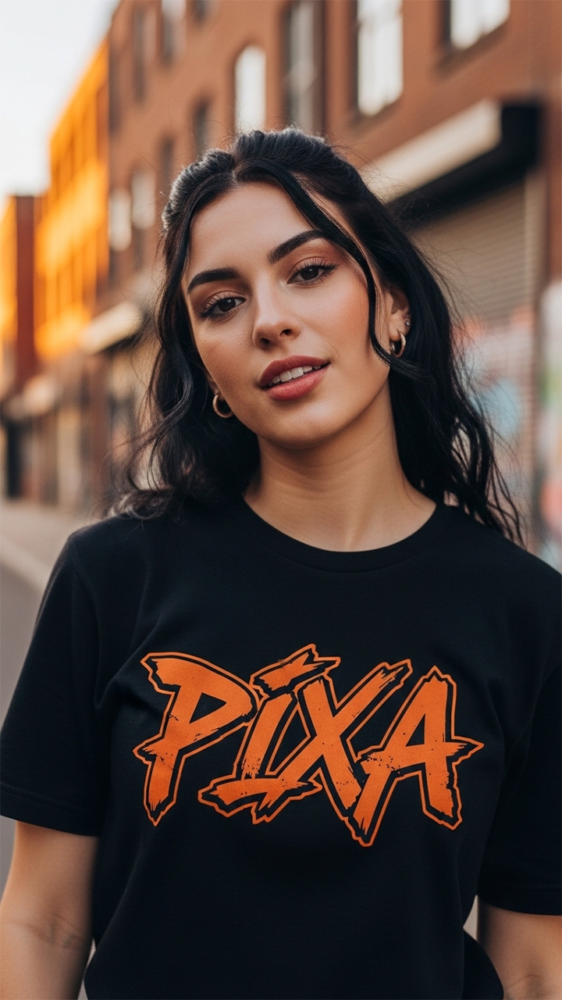

### Output 01

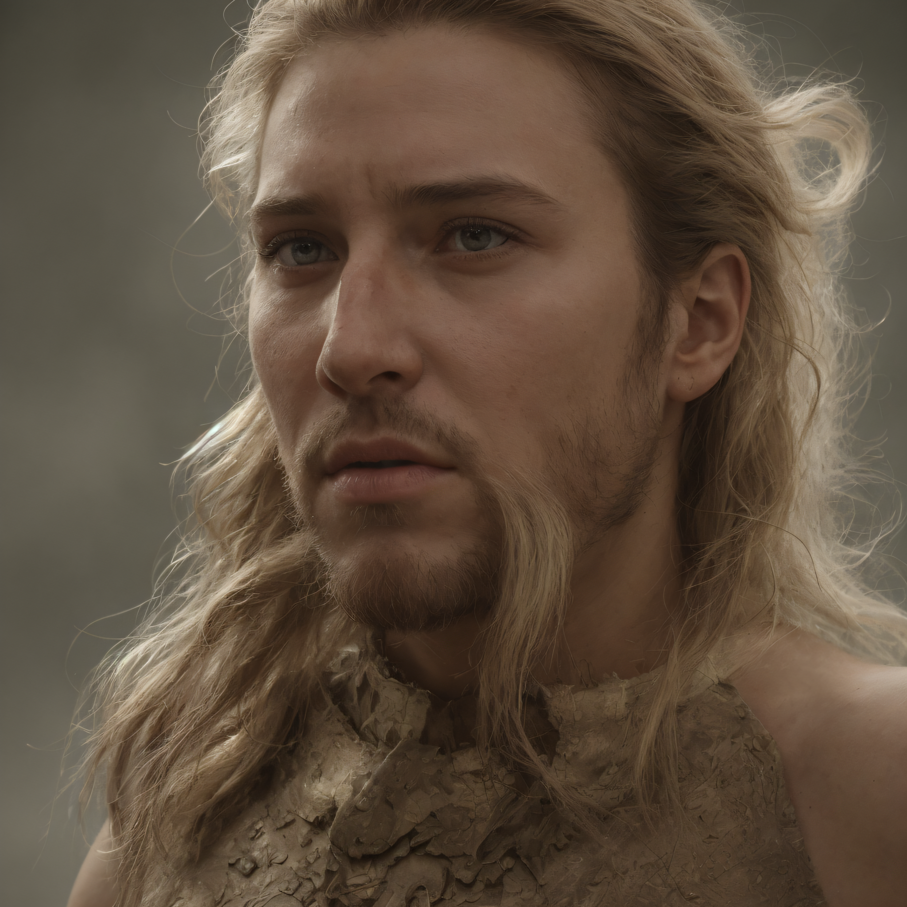

### Output 02

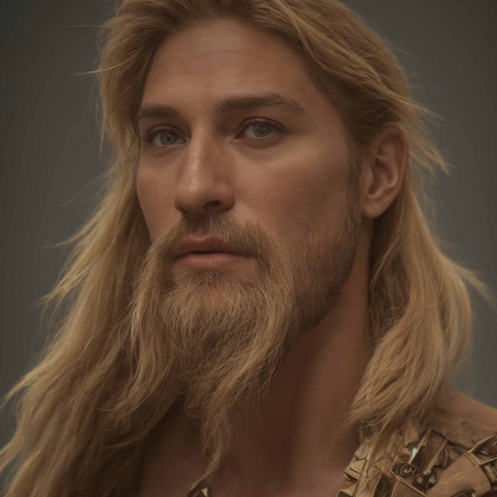

### Output 03

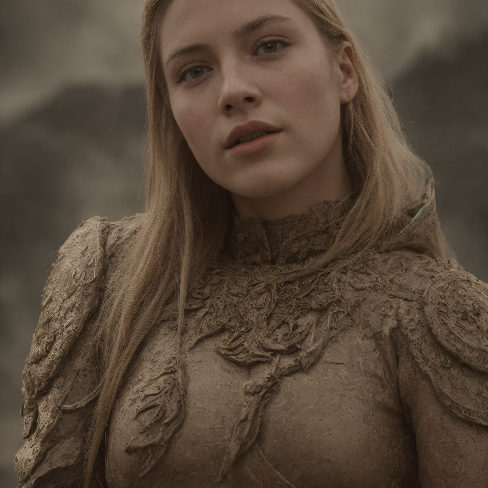

### Output 04

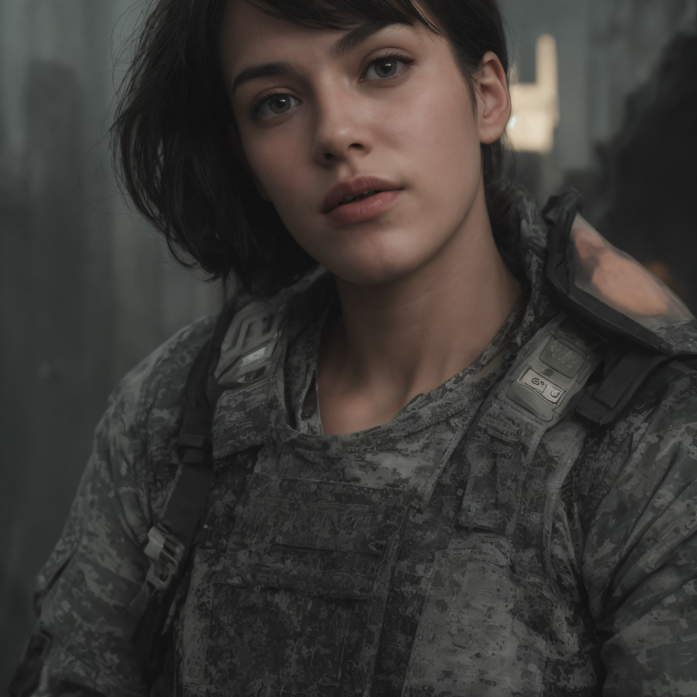

### Output 05

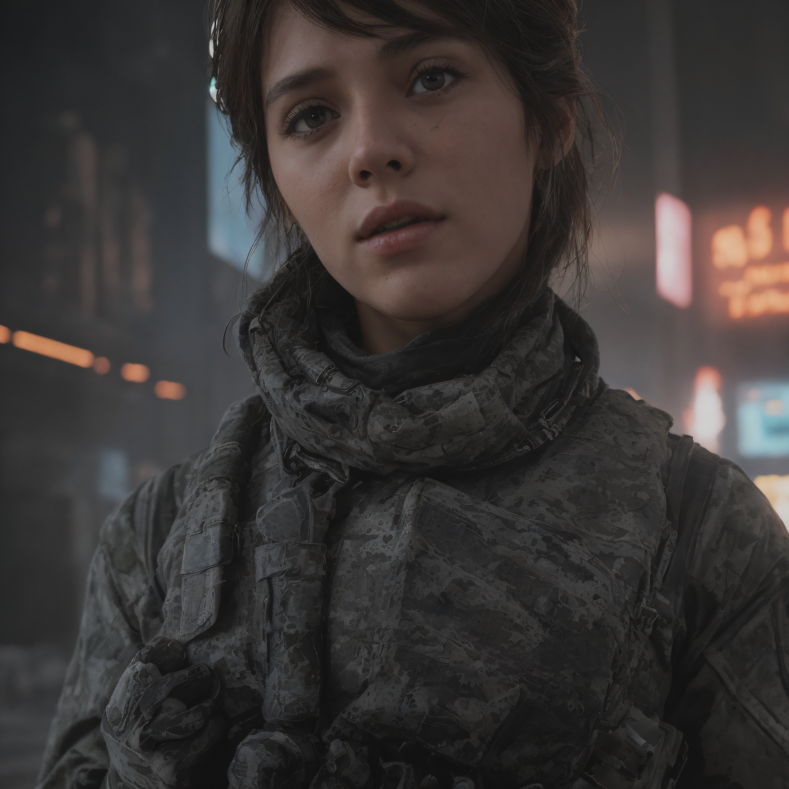

---

## Workflow Overview

```text
Reference Image
        ↓
OpenPose Preprocessor
        ↓
ControlNet
        ↓
SDXL
        ↓
LoRA
        ↓
KSampler
        ↓
VAE Decode
        ↓
Upscaler
        ↓
Save Image
```

---

## Technical Stack

| Category        | Technology    |
| --------------- | ------------- |
| Workflow Engine | ComfyUI       |
| Base Model      | SDXL          |
| Conditioning    | ControlNet    |
| Pose Extraction | OpenPose      |
| Enhancement     | LoRA          |
| Sampling        | DPM++ 2M SDE  |
| Scheduler       | Karras        |
| Upscaling       | 4x UltraSharp |

---

## Documentation

| Document                                                                  | Description                                |
| ------------------------------------------------------------------------- | ------------------------------------------ |
| 📘 [Node Explanations](docs/node-explanations.md)                         | Detailed explanation of all workflow nodes |
| 📗 [Optimization Notes](docs/optimization-notes.md)                       | Workflow testing and optimization          |
| 📙 [Architecture Explanation](interview-prep/architecture-explanation.md) | Design decisions and workflow architecture |
| 📕 [Technical Interview Questions](interview-prep/technical-questions.md) | Technical discussion preparation           |
| 📔 [Recruiter Questions](interview-prep/recruiter-questions.md)           | Portfolio presentation preparation         |

---

## Learning Objectives

* ControlNet Conditioning
* OpenPose Integration
* Character Consistency
* Workflow Optimization
* Production-Oriented AI Pipelines

---

## Future Improvements

* IPAdapter
* Flux Integration
* Multi-ControlNet Pipelines
* Video Generation
* Character Identity Preservation

---

## Author

Gowtham Subramanian

Generative AI Workflow Designer | Technical Artist | Senior Digital Compositor
